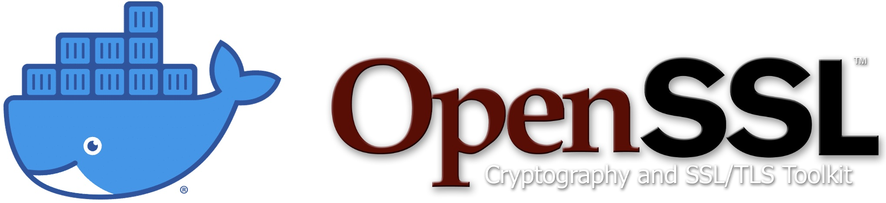

# OpenSSL and libfaketime on Docker
Docker Container with Alpine Linux 3.17.3, OpenSSL 3.1.0 and libfaketime 0.9.10.  

  

**WARNING** This script was made for educational purposes ONLY. USE AT YOUR OWN RISK!  

### You can pull the image directly from [Docker Hub](https://hub.docker.com/r/ddella/openssl) with the command:
```shell
docker pull ddella/openssl
```
## Introduction
This will build a Docker image, from scratch, with OpenSSL 3.1.0 on Alpine Linux 3.17.3. I also included [libfaketime](https://github.com/wolfcw/libfaketime). The purpose of this container is to be able to generate certificate in different moment in time, for testing purposes.  

The build is a five step process:

1. Get the Alpine Mini RootFS
2. Build the Docker image from scratch
3. Test the container locally
4. Trim down the image
5. Run the container

## 1. Alpine Mini RootFS
Use this command to download the Alpine 3.17.3 mini root filesystem:
```shell
curl -O https://dl-cdn.alpinelinux.org/alpine/v3.17/releases/x86_64/alpine-minirootfs-3.17.3-x86_64.tar.gz
```
>The file is ~3.2MB

## 2. Download OpenSSL 3.1.0
Use this command to download the source code of OpenSSL:
```shell
curl -O https://www.openssl.org/source/openssl-3.1.0.tar.gz
```

## 3. Build the Docker image from scratch
You need the files `Dockerfile`, `banner`, `motd`, `buildopenssl.sh`, and `entrypoint.sh`.  

Use this command to build the Docker image:
```shell
docker build . -t tempo:3.1.0
```

>**Note**: The build takes between **15-20 minutes** !!!

## 4. Test the container locally
Use this command to run your container and get a shell.
```sh
docker run -it --rm --entrypoint /bin/sh --env TZ='EAST+5EDT,M3.2.0/2,M11.1.0/2' --env TIMEZONE='America/New_York' --name openssl --hostname=openssl tempo:3.1.0
```
The root password is `root`. I know, not the most secure password and it can be easily guessed 😀  
You can also use the username `remote`. This time I had security in mind so the password is very complicated. It will be in clear on the banner page 🤣  

Test OpenSSL wit the command:
```sh
openssl version
```

If you want to test the `libfaketime` library, use this command:
```shell
LD_PRELOAD=libfaketime.so.1 FAKETIME="2025-01-01 10:10:00" FAKETIME_DONT_RESET=1 /bin/date
```
>Output:  
>Wed Jan  1 10:10:00 EAST 2025

Check OpenSSL with the command:
```sh
openssl version
```
>Ouput:
>OpenSSL 3.1.0 14 Mar 2023 (Library: OpenSSL 3.1.0 14 Mar 2023)

**Don't exit the container for now.**

## 5. Trim down the container
Start a new shell and leave the container running:

If you take a look at the container, the size is 1.4Gb. We could do way better. Let's trim it down.
>```
>REPOSITORY               TAG               IMAGE ID       CREATED          SIZE
>tempo                    3.1.0             1c9fc5f9d9f6   2 minutes ago   1.41GB
>```

Use the following command to export the root filesystem to a local file **It NEEDS to be run as root**:
```shell
sudo docker export $(docker ps -f "name=openssl" -q) > openssl-minirootfs-3.1.0-x86_64.tar
```
>If you use option `-o` with `docker export` command, the file created will be owned by `root`.  

Use the following command to import the root filesystem back to Docker:
```shell
docker import -c 'ENTRYPOINT ["/entrypoint.sh"]' openssl-minirootfs-3.1.0-x86_64.tar openssl:3.1.0
```

>The final Docker image `openssl:3.1.0` is ~52Mb
>```
>REPOSITORY               TAG               IMAGE ID       CREATED          SIZE
>openssl                  3.1.0             544147acb910   14 minutes ago   51.9MB
>```
### Cleanup
Exit the running container you started in step 4 and delete the temporary Docker image. If you forget to exit the running container, you will reveive the following error message:  

>Error response from daemon: conflict: unable to remove repository reference "tempo:3.1.0" (must force) - container 0c76afe2763e is using its referenced image 1c9fc5f9d9f6  

Use this command to delete image:
```shell
docker rmi tempo:3.1.0
```
>You can delete the file `alpine-minirootfs-3.17.3-x86_64.tar.gz`.  
## 5. Run the container
Use this command to start the container in detach mode:
```shell
docker run --rm -d -p 2222:22 --name openssl --env TZ='EAST+5EDT,M3.2.0/2,M11.1.0/2' --env TIMEZONE='America/New_York' -v ~/Downloads/:/var/tmp --hostname=openssl openssl:3.1.0
```
>**Note**: Change the mapping of the local drive to suit your needs.  

Open a terminal an SSH to the new container with the username `root`. You remember the password 😀:
```shell
ssh -l root -p 2222 127.0.0.1
```

Open a terminal an SSH to the new container with the username `remote`. Take a look at the banner, you should see the password:
```shell
ssh -l remote -p 2222 127.0.0.1
```

>In this example, if you do `ls -la /var/tmp` inside the container, I see my local `~/Downloads/` directory.  
## 6. Terminate the container
Use this to terminate the container:
```sh   
docker rm -f openssl
```
# Create a certificate
Let's try to generate a certificate in the future (or in the past). I have a simple script to generate a self-signed certificate with ECC keys [here](https://gist.github.com/ddella/f6954409d2090908f6fec1fc3280d9d1). Copy the file to you local drive that you mapped inside your container. Start the container, SSH in it and execute the script or any OpenSSL command preceding with `LD_PRELOAD=libfaketime.so.1 FAKETIME="YYYY-MM-DD HH:MM:SS"`.  

>If you mapped your local `~/Downloads/` directory to the directory `/var/tmp` inside the container, just copy the script to create your certificates in your local `~/Downloads/` directory. It will be accessible in the container via `/var/tmp`.  

Use this command to start the container:
```
docker run --rm -d -p 2222:22 --name openssl --env TZ='EAST+5EDT,M3.2.0/2,M11.1.0/2' --env TIMEZONE='America/New_York' -v ~/Downloads/:/var/tmp --hostname=openssl openssl:3.1.0
```

Use this command to acces the container:
```shell
ssh -l remote -p 2222 127.0.0.1
```

Use this command, inside the container, to create a certificate either in the future or in the past. Just set the date:
```shell
cd /var/tmp/
LD_PRELOAD=libfaketime.so.1 FAKETIME="2035-01-01 10:10:00" ./self_signed_ecc.sh bogus_certificate
```
>The key and certificate will be on your local drive, not inside the container.
## License
This project is licensed under the [MIT license](/LICENSE).  

[_^ back to top of page_](#OpenSSL-and-libfaketime-on-Docker)  
[_< back to root_](../../../)
